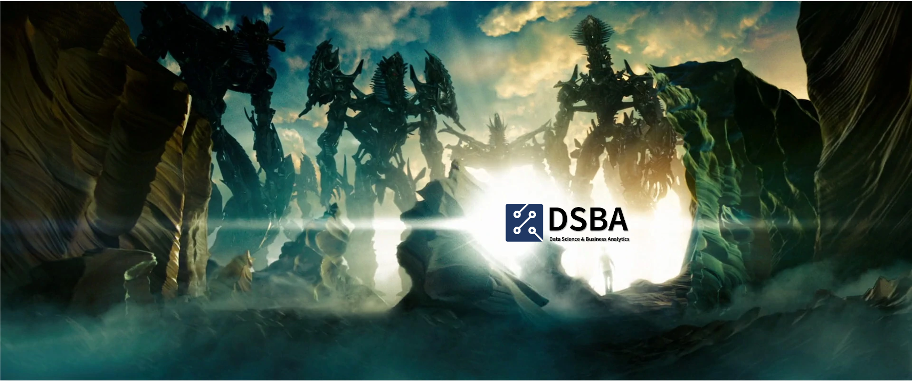
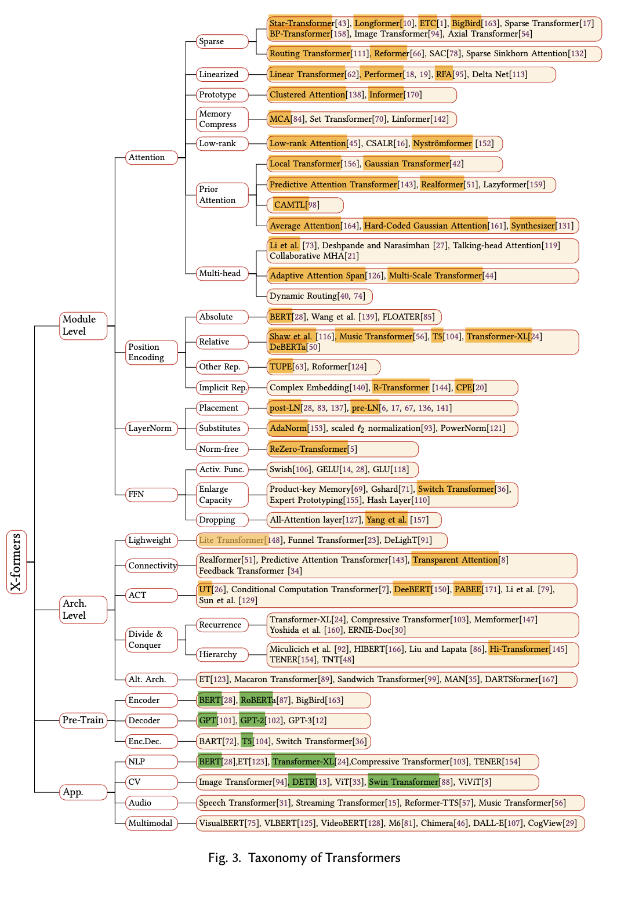

# 🤗 Transformer_Survey_Paper_Study 🤗

**"A survey of Transformer"** paper study @DSBA Lab

📃 Paper : Lin, Tianyang, et al. "A Survey of Transformers." *arXiv preprint arXiv:2106.04554* (2021)  [[Link](https://arxiv.org/pdf/2106.04554.pdf)]

## 1. 스터디 소개

#### 1) Members (@DSBA Lab )

고려대학교 산업경영공학과 Data Science & Business Analytics Lab [[HomePage](http://dsba.korea.ac.kr/)] [[Youtube](https://www.youtube.com/channel/UCPq01cgCcEwhXl7BvcwIQyg/videos)] 

: Transformer와 NLP를 사랑하는 연구실 학생들로 구성된 스터디 입니다 🙂

|                 yukyung               |                 myeongsup                |              hoonsang               |                   jina                   |                   jaehyuk                   |                   subin                   |
| :------------------------------------------: | :-----------------------------------------: | :----------------------------------------: | :---------------------------------------------: | :---------------------------------------------: | :---------------------------------------------: |
|  |  |  |  |  |  |
|                   **[Github](https://github.com/yukyunglee)**                   |                   **[Github](https://github.com/msub0310)**                   |               **[Github](https://github.com/Hoonst)**               |                   **[Github](https://github.com/jina-kim7)**                   |                   **[Github](https://github.com/TooTouch)**                   |                   **[Github](https://github.com/suubkiim)**                   |

## 2. 스터디 목적 및 방향

#### 0) 스터디 범위

: 이 스터디는 서베이 논문에서 나오는 모든 논문중에서 노란색으로 표시된 논문을 다룹니다 (초록색: 연구실 세미나에서 다룬 적 있음)

#### 1) 스터디 목적

: 이 스터디는 논문에 나오는 모든 Transformer의 구조를 이해하기 위한 것이 아니며, 논문을 통해 기존 Transformer 대비 Module level - Arch level, Pretrain level에서 어떤 변화가 있는지 흐름을 살펴보는 것을 목적으로 합니다.

#### 2) 스터디 방향

- 모든 인원이 해당 논문을 1회독 해야합니다.
- 각 챕터별로 인원을 배정하여 해당 파트를 core하게 공부할 사람을 정하고, 발표자료 제작과 스터디 발표를 담당합니다.
- 발표 자료를 제작하는 이유: 공부한 내용을 정리하는 과정을 통해 이해한 내용을 구조화 하기 위함입니다.
- 각 챕터별로 논문 내용을 쭉 훑어준 후 끝나는것이 아니라, 해당 부분에서 중요할 것 같은 '핵심'개념을 찾아 그 개념을 자세히 설명해주시면 됩니다
- 추후 자신의 챕터로 발표영상을 제작한 후 연구실 유튜브에 업로드 해야합니다

#### 3) 스터디 기간 : 2021/7/7 ~ 2021/7/30

* 7/7 ~ 7/18 : 논문 개인 공부
* 7/19 ~ 7/29 : 스터디 진행
* 7/30 : 스터디 영상 업로드 (예정, [DSBA Youtube channel](https://www.youtube.com/channel/UCPq01cgCcEwhXl7BvcwIQyg/videos)) 

## 3. 스터디 운영 

**00) Introduction**

>- [영상](https://www.youtube.com/watch?v=pOdLQIjGfl0&list=PLetSlH8YjIfXCRQ28UHh07wxkIxdU5c7-) / [발표자료](https://github.com/yukyunglee/Transformer_Survey_Study/blob/main/Presentation/TSS_%230_intro.pdf)
>- 발표자 : 이유경 박사과정
>- 편집 : 윤훈상 석사과정, 허재혁 석사과정

**01) Transformer basic (1~6 Page)**

>- [영상](https://www.youtube.com/watch?v=rjHaxK2iWX4&list=PLetSlH8YjIfXCRQ28UHh07wxkIxdU5c7-&index=2) / [발표자료](https://github.com/yukyunglee/Transformer_Survey_Study/blob/main/Presentation/TSS_%231_Transformer_Basic.pdf)
>- 주제 : Vanilla Transformer
>- 스터디 진행 : 7/20
>- 발표자 : 김수빈 석사과정

**02) Module-level : Attention 1 (6~11 Page)**

>- [영상](https://www.youtube.com/watch?v=m8rWN2-VkcU&list=PLetSlH8YjIfXCRQ28UHh07wxkIxdU5c7-&index=4) / [발표자료](https://github.com/yukyunglee/Transformer_Survey_Study/blob/main/Presentation/TSS_%232_Sparse_Attention.pdf)
>- 주제 : Sparse Attention
>- 스터디 진행 : 7/21
>- 발표자 : 윤훈상 석사과정

**03) Module-level : Attention 2  (11~15 Page)**

>- [영상](https://www.youtube.com/watch?v=FNGcX23DFLU&list=PLetSlH8YjIfXCRQ28UHh07wxkIxdU5c7-&index=5) / [발표자료](https://github.com/yukyunglee/Transformer_Survey_Study/blob/main/Presentation/TSS_%233_Linearized_Attention_Prototype_and_Memory_Compression.pdf)
>- 주제 : Linearized / Prototype / Memory Compress Attention
>- 스터디 진행 : 7/27
>- 발표자 : 김지나 석박통합과정

**04) Module-level : Attention 3  (15~20 Page)**

>- [영상](https://www.youtube.com/watch?v=aN1Yn2QWDHc&list=PLetSlH8YjIfXCRQ28UHh07wxkIxdU5c7-&index=6) / [발표자료](https://github.com/yukyunglee/Transformer_Survey_Study/blob/eea1533802a9edf4c6cb2adc384900f85f38f9df/Presentation/TSS_%234_Lowrank_Prior_Improved_Attention.pdf.pdf)
>- 주제 : LowRank SeltAttention / Attention with Prior / Improved Multi-Head Mechanism
>- 스터디 진행 : 7/28
>- 발표자 : 이유경 석박통합과정

**05) Module-level : Others  (20~26 Page)**

>- [영상](https://www.youtube.com/watch?v=9wTkdGAgT7w&list=PLetSlH8YjIfXCRQ28UHh07wxkIxdU5c7-&index=7) / [발표자료](https://github.com/yukyunglee/Transformer_Survey_Study/blob/a2f9375ec1bcd75e33581461b89a61b7b125d7a2/Presentation/TSS_%235_Other_Module_Level_Modifications.pdf)
>- 주제 : Position Encoding / LayerNorm / FFN
>- 스터디 진행 : 7/29
>- 발표자 : 허재혁 석사과정

**06) Arch.-level ~ end  (26~33 Page)**

>- [영상](https://www.youtube.com/watch?v=Mtimidtm3zc&list=PLetSlH8YjIfXCRQ28UHh07wxkIxdU5c7-&index=9) / [발표자료](https://github.com/yukyunglee/Transformer_Survey_Study/blob/a2f9375ec1bcd75e33581461b89a61b7b125d7a2/Presentation/TTS_%236_Architectur_Level_Varient.pdf)
>- 주제 : Architecture-level variant
>- 스터디 진행 : 7/30
>- 발표자 : 김명섭 석사과정

**07) Appendix : 당신이 모르는 transformer의 3가지 사실**

>- [영상](https://www.youtube.com/watch?v=ktYuOq3lWyY&list=PLetSlH8YjIfXCRQ28UHh07wxkIxdU5c7-&index=8) / [발표자료](https://github.com/yukyunglee/Transformer_Survey_Study/blob/main/Presentation/TTS_Appendix_Complexity_Parameters_Scaling.pdf)
>- 주제 : [Transformer] Complexity, Parameters, and Scaling
>- 스터디 진행 : 7/28
>- 발표자 : 김명섭 석사과정

## 4. 스터디 규칙

1. 어떤 질문이든 할 수 있습니다
   - 모르는 부분을 채우기 위해 기본적이고 쉬운 질문도 주고받을 수 있습니다
   - 어떤 쉬운 질문을 하더라도 진지하게 논의합니다
2. 질문을 대하는 태도
   - 질문은 최대한 예의를 갖추어 질문합니다
3. 발표 자료 퀄리티
   - 발표자료는 세미나처럼 성의를 담아 구성합니다
   - 다만 너무 길게 만들 필요는 없습니다
4. 추후 보강
   - 스터디에서 논의한 내용을 해당 챕터 담당자가 정리하여 공유합니다
     - 함께 나누었던 질문 및 대답들
   - 스터디 중간에 대답하지 못했던 정보들은 스터디 종료 후 정리하여 공유합니다
     - 이 또한 아카이빙 해주세요 !

